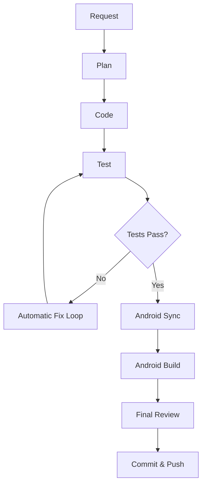

# Shared AI Development Workflow

This document defines the process, safety rules, testing guidelines, automatic fix loops, and git requirements for the shared multi-agent development workflow in this repository.

## Workflow Sequence

1. **Request**: The user specifies a request. The exact intent and non-negotiable requirements are stored in `REQUEST.md`.
2. **Plan**: Written by the Planner (Antigravity/Gemini) in `PLAN.json`, defining features, steps, risks, testing types, and forbidden changes.
3. **Code**: Implemented by the Coder (Claude Code). Changes are restricted to the plan.
4. **Test**: Run browser-testable validations using Playwright. Results are captured in `TEST_RESULTS.json`.
5. **Fix**: If tests fail, run the Automatic Fix Loop.
6. **Android Sync**: Run `npx cap sync android` to push web code changes to the Android native wrapper.
7. **Android Build**: Compile the app locally using Gradle: `cd android` then `.\gradlew.bat clean assembleDebug` to verify compilation.
8. **Final Review**: Antigravity/Gemini writes `FINAL_REVIEW.json`, comparing implementation/diffs/build results.
9. **Commit & Push**: Commit and push changes on descriptive feature branches (never directly to `main`).

---

## Safety Rules

### Automatically Allowed Operations
- Reading files and searching code.
- Creating and modifying workflow files.
- Editing source code for an approved task.
- Running local development servers.
- Running Playwright browser tests.
- Running linting and static checks.
- Synchronizing Android assets: `npx cap sync android`.
- Compiling debug builds: `.\gradlew.bat clean assembleDebug`.
- Staging, committing, and pushing feature branches.

### Forbidden Operations (Explicit Approval Required)
- Pushing directly to `main` or merging `feature` branches into `main` automatically.
- Force pushing or rewriting Git history.
- Deleting remote branches.
- Deleting user data or resetting workout history/food logs/profile information/Health Connect preferences.
- Exposing API keys, credentials, or committing `.env` files containing secrets.
- Deploying to production or publishing to Google Play.
- Modifying production Firebase security rules.

---

## Testing Rules

### Browser-Testable (Playwright MCP)
- Web layouts, page rendering, navigation.
- Local form fields, localStorage persistence, local page logic.
- Mock integrations and fallbacks.

### Non-Browser Testable (Device/Emulator Only)
The following capabilities **must never** be claimed as verified by Playwright:
- Real Health Connect database reads/writes.
- Android system permissions and prompts.
- Android application lifecycle events.
- Native Kotlin/Java Capacitor bridge behavior.
- Google Sign-In with Firebase on an Android device.
- Native system notifications and canvas shares via native FileProvider.

---

## Automatic Fix Loop

If Playwright tests fail:
1. Log exact failures, console logs, and errors in `TEST_RESULTS.json`.
2. Claude Code analyzes the root cause and performs the smallest appropriate code edit.
3. Playwright MCP reruns the failed tests.
4. This cycle may repeat up to **5 times**.
5. If still failing after 5 attempts, stop, mark status as `BLOCKED` in `FINAL_REVIEW.json`, and report to the user. Do not continue making speculative modifications.

---

## Git Rules

- Always verify branch and uncommitted changes with `git status` before writing code.
- Develop inside descriptive feature branches starting from `main` (e.g., `feature/automatic-health-sync`).
- Never stage or commit `node_modules/`, `.gradle/`, `build/`, build outputs (APKs/AABs), or credentials/secrets.
- Review the full `git diff` before making a commit.
